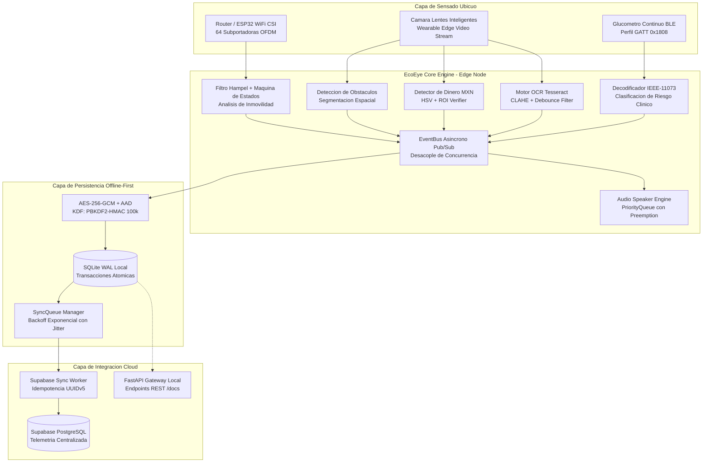

# EcoEye: Sistema de Computacion Ubicua e Inteligencia Ambiental Asistencial

**HackaTec Regional 2026 — Categoria 5: Software Inteligente**  
*Plataforma Edge-Computing para Asistencia No Invasiva, Deteccion de Incidentes, Reconocimiento Visual y Monitoreo Biometrico Continuo.*

---

## 1. Resumen Ejecutivo y Declaracion del Problema

El envejecimiento poblacional y la prevalencia de patologias metabolicas cronicas (especialmente Diabetes Mellitus Tipo 1 y 2) exigen mecanismos de supervision continua en adultos mayores y personas con vulnerabilidad visual o motriz. Sin embargo, las soluciones convencionales presentan fallas criticas de adopcion:

1. **Intrusion a la Privacidad**: El uso de camaras de vigilancia optica dentro de areas privadas (banos, recamaras) es sistematicamente rechazado por los usuarios y viola normativas de proteccion de datos sensibles.
2. **Dependencia de Dispositivos Manuales**: Los colgantes de panico y botones de emergencia requieren accion consciente por parte del paciente, resultando ineficaces ante desmayos, traumatismos craneoencefalicos por caidas o crisis de hipoglucemia severa.
3. **Barreras en la Vida Cotidiana**: Las personas con discapacidad visual enfrentan serias dificultades para identificar dinero en efectivo al realizar pagos y leer letreros, senalizaciones urbanas o etiquetas de medicamentos.
4. **Fragilidad de Conexion a la Nube**: La mayoria de sistemas asistenciales comerciales son dependientes de conexion activa a Internet, perdiendo capacidad de respuesta local ante caidas de red o cortes de suministro electrico.

**EcoEye** resuelve esta problematica mediante un paradigma de **Computacion Ubicua, Inteligencia Ambiental y Privacidad por Diseno (Zero-Camera Indoors)**:
* **Supervision en Interiores (Zero-Camera)**: Deteccion de presencia y caidas analizando perturbaciones de radiofrecuencia mediante **WiFi CSI (Channel State Information)** sobre 64 subportadoras OFDM.
* **Asistencia Visual en Lentes Inteligentes (Wearable Edge)**:
  * **Navegacion Espacial**: Segmentacion de obstaculos por sectores (Izquierda, Centro, Derecha) con clasificacion de urgencia por proximidad.
  * **Reconocimiento de Dinero**: Clasificacion cromatica y geometrica de billetes ($20, $50, $100, $200, $500, $1,000 MXN) y monedas con verbalizacion de audio inmediata.
  * **Lectura de Texto OCR**: Extraccion optica de letreros, etiquetas y medicamentos con preprocesamiento adaptativo CLAHE, filtrado de ruido y supresion de repeticiones (debounce).
* **Telemetria Clinica BLE**: Captura automatizada de glucemia en sangre via Bluetooth Low Energy bajo el perfil estandar GATT `0x1808` / `0x2A18`.
* **Arquitectura Offline-First y Criptografia Militar**: Persistencia local transaccional SQLite WAL con cifrado simetrico **AES-256-GCM + PBKDF2-HMAC-SHA256 (100,000 rondas)** y sincronizacion idempotente con backoff exponencial hacia Supabase Cloud.

---

## 2. Arquitectura del Sistema

El sistema implementa una arquitectura desacoplada basada en eventos, disenada para operar en hardware embebido (Raspberry Pi 4/5, Jetson Nano, NUC industrial) manteniendo baja latencia y consumo termico contenido.



---

## 3. Modulos y Mecanismos de Ingenieria

### 3.1. Deteccion de Caidas por WiFi CSI (Zero-Camera Indoors)
* **Principio Fisico**: Cuando una persona se mueve en un entorno cerrado con senales WiFi (IEEE 802.11n/ac/ax), el cuerpo humano absorbe, dispersa y refleja las ondas de radiofrecuencia. El receptor captura matrices complejas de canal:
  $$H(f, t) = |H(f, t)| e^{j \angle H(f, t)}$$
* **Filtro Hampel**: Algoritmo robusto basado en desviacion absoluta respecto a la mediana (MAD) que suprime ruido termico y desvanecimientos transitorios sin retrasar la respuesta temporal:
  $$\text{MAD} = \text{median}(|x_i - \tilde{x}|)$$
* **Maquina de Estados Finitos**:
  1. `IDLE`: Monitoreo continuo de varianza espectral.
  2. `SPIKE_DETECTED`: Registro de caida libre o impacto abrupto (energia > umbral $\mu + 3.0\sigma$).
  3. `CONFIRMING_STILLNESS`: Ventana de confirmacion (3.0 segundos). Si el sujeto reanuda actividad, se descarta como falso positivo (e.g., sentarse rapido).
  4. `FALL_TRIGGERED`: Transicion a alerta confirmada con emision de alarma auditiva y encolado prioritario.

### 3.2. Percepcion Espacial de Obstaculos para Exteriores
* **Segmentacion Visual**: Clasificacion angular de obstaculos en tres sectores relativos:
  * `LEFT` ($-45^\circ \text{ a } -15^\circ$)
  * `CENTER` ($-15^\circ \text{ a } +15^\circ$)
  * `RIGHT` ($+15^\circ \text{ a } +45^\circ$)
* **Escala de Urgencia**:
  * `CRITICAL` ($< 0.8\text{ m}$): Peligro inminente de colision. Notificacion inmediata.
  * `WARNING` ($0.8\text{ m} - 1.8\text{ m}$): Advertencia preventiva para maniobra de evasion.
  * `INFO` ($> 1.8\text{ m}$): Percepcion contextual de baja prioridad.

### 3.3. Deteccion y Clasificacion de Dinero en Efectivo (Billetes y Monedas)
* **Reconocimiento Cromático en HSV/Lab**: Cada denominación de la familia de billetes de México presenta firmas espectrales características:
  * $\$20\text{ MXN}$: Azul/cian y tintes rojizos.
  * $\$50\text{ MXN}$: Magenta y rosa intenso.
  * $\$100\text{ MXN}$: Rojo bermellón y marrón.
  * $\$200\text{ MXN}$: Verde esmeralda.
  * $\$500\text{ MXN}$: Azul marino profundo.
  * $\$1,000\text{ MXN}$: Gris violeta y ocre.
* **Verificacion Geometrica y OCR de Denominacion**: Localizacion de la Region de Interes (ROI) y validacion numerica de la denominacion nominal.
* **Control de Repeticion (Debounce)**: Memoria temporal de 3.0 segundos que evita reiterar el anuncio si el usuario mantiene el billete en la mano.

### 3.4. Lectura de Texto mediante OCR en Lentes Inteligentes
* **Preprocesamiento Optico Adaptativo**:
  * Correccion de contraste mediante CLAHE (Contrast Limited Adaptive Histogram Equalization).
  * Filtrado bilateral para preservar bordes nitidos mientras se atenua el grano del sensor.
  * Binarizacion adaptativa Otsu para maximizar la separacion texto/fondo en exteriores e interiores.
* **Motor de Reconocimiento**: Inferencia local con Tesseract OCR (`image_to_data` con analisis de nivel de confianza por palabra).
* **Filtro de Ruido y Normalizacion Linguistica**: Descarte de artefactos no legibles, normalizacion de puntuacion y signos repetidos.
* **Deduplicacion Basada en Hash**: Cache temporal de 10.0 segundos que indexa el hash MD5 del texto normalizado para no saturar al usuario si fija la mirada en el mismo letrero.

### 3.5. Monitoreo Glucemico Continuo BLE
* **Perfil GATT**: Implementacion del estandar Bluetooth SIG `0x1808` (Glucose Service) y `0x2A18` (Glucose Measurement).
* **Decodificacion de Punto Flotante**: Parseo de formato IEEE-11073 SFLOAT (12-bit mantisa con signo, 4-bit exponente).
* **Clasificacion de Umbrales Clinicos**:
  * $< 54\text{ mg/dL}$: Hipoglucemia Severa (Alerta Nivel 1 - Maxima Prioridad).
  * $54 - 69\text{ mg/dL}$: Hipoglucemia Moderada.
  * $70 - 140\text{ mg/dL}$: Rango Euglucemico Optimo.
  * $141 - 180\text{ mg/dL}$: Hiperglucemia Leve.
  * $181 - 250\text{ mg/dL}$: Hiperglucemia Elevada.
  * $> 250\text{ mg/dL}$: Hiperglucemia Severa / Riesgo de Cetoacidosis.

### 3.6. Motor de Audio Sintetizado Priorizado
* Implementa una cola concurrente (`PriorityQueue`) con mecanismo de preempcion y descarte controlado:
  * **Prioridad 1**: Caidas y crisis de hipoglucemia severa (ininterrumpibles).
  * **Prioridad 2**: Obstaculos criticos al frente (< 0.8m), billetes detectados y lecturas OCR importantes.
  * **Prioridad 3**: Notificaciones de estado e informativas.
* Dispone de mecanismo de tolerancia a fallos (*headless fallback*): en entornos sin tarjeta de sonido o contenedores CI/CD, conmuta de forma transparente al registro estructurado del sistema sin colapsar el hilo.

---

## 4. Criptografia y Seguridad en Reposo

La telemetria medica y los eventos de privacidad estan blindados mediante estandares del Instituto Nacional de Estandares y Tecnologia (NIST):

| Parametro | Implementacion | Justificacion Tecnica |
| :--- | :--- | :--- |
| **Cifrado Simetrico** | AES-256-GCM | Confidencialidad e integridad criptografica autenticada (AEAD). |
| **Derivacion de Llaves** | PBKDF2-HMAC-SHA256 | Proteccion contra ataques de diccionario y hardware ASIC/GPU. |
| **Iteraciones KDF** | 100,000 rondas | Cumplimiento de guias NIST SP 800-132. |
| **Vector de Inicializacion** | 12 bytes CSPRNG | Unico e irrepetible por cada operacion de cifrado. |
| **Salt Criptografico** | 16 bytes CSPRNG | Previene ataques de tablas arcoiris sobre la base de datos. |
| **Datos Autenticados (AAD)** | `device_id` + `timestamp` | Asocia el texto cifrado a su origen e impide ataques de reordenamiento o suplantacion. |

---

## 5. Persistencia Local y Sincronizacion Idempotente

### 5.1. SQLite en Modo WAL
La persistencia local utiliza SQLite configurado explicitamente para entornos embebidos de alta concurrencia:
```sql
PRAGMA journal_mode = WAL;
PRAGMA synchronous = NORMAL;
PRAGMA foreign_keys = ON;
PRAGMA busy_timeout = 5000;
```
Esto permite lectores concurrentes sin bloqueo mientras los hilos de sensado (CSI, BLE, Visión) insertan telemetria continuamente.

### 5.2. Cola de Sincronizacion con Jitter Completo
Para mitigar el problema de *thundering herd* cuando la conexion a Internet se restablece tras una desconexion prolongada, el `SyncQueueManager` implementa un algoritmo de retroceso exponencial con aleatoriedad total (*Full Jitter*):
$$t_{\text{sleep}} = \text{random}(0, \min(T_{\text{max}}, T_{\text{base}} \times 2^{\text{intentos}}))$$
Los registros que exceden 5 intentos fallidos son transferidos a un estado `dead_letter` para auditoria forense sin bloquear el resto de la cola.

### 5.3. Idempotencia Determinista (UUIDv5)
Cada registro remoto se genera mediante UUID version 5 derivado de un espacio de nombres DNS exclusivo de EcoEye y la llave compuesta `device_id:entity_type:entity_id:timestamp`. Esto garantiza que peticiones repetidas debido a fallos de red jamas produzcan duplicados en la base de datos central de Supabase.

---

## 6. Interfaz de Programacion de Aplicaciones (REST API)

El nodo Edge expone una API REST local construida en FastAPI, permitiendo integracion con tableros de visualizacion y herramientas de diagnostico:

| Metodo | Endpoint | Descripcion | Formato de Respuesta |
| :--- | :--- | :--- | :--- |
| `GET` | `/health` | Estado del nodo, tiempo de actividad y version. | JSON |
| `GET` | `/api/v1/stats` | Conteo de lecturas, eventos y estado de sincronizacion. | JSON |
| `GET` | `/api/v1/alerts/falls` | Historial de caidas registradas con severidad y ubicacion. | JSON |
| `GET` | `/api/v1/readings/glucose` | Ultimas mediciones de glucosa y clasificacion clinica. | JSON |
| `GET` | `/api/v1/detections/obstacles` | Ultimas detecciones de obstaculos y distancias. | JSON |
| `GET` | `/api/v1/detections/currency` | Ultimas detecciones de billetes y monedas con denominacion. | JSON |
| `GET` | `/api/v1/readings/ocr` | Ultimas lecturas de texto extraidas mediante OCR. | JSON |
| `POST` | `/api/v1/vision/currency/process` | Procesamiento interactivo de imagen o denominacion de dinero. | JSON |
| `POST` | `/api/v1/vision/ocr/process` | Procesamiento interactivo de imagen o texto OCR bajo demanda. | JSON |
| `POST` | `/api/v1/sync/flush` | Fuerza la ejecucion inmediata del ciclo de sincronizacion. | JSON |
| `GET` | `/docs` | Documentacion interactiva OpenAPI / Swagger UI. | HTML |

---

## 7. Estructura del Repositorio

```
ecoeye/
├── .env.example                  # Plantilla de variables de entorno seguras
├── .gitignore                    # Exclusion estricta de DBs, caches y secretos
├── README.md                     # Documentacion tecnica de ingenieria
├── pyproject.toml                # Metadatos del paquete y configuracion de herramientas
├── requirements.txt              # Especificacion de dependencias de produccion
├── scripts/
│   └── run_demo.py               # Punto de entrada directo para evaluacion y demos
├── tests/
│   ├── test_security.py          # Pruebas unitarias de cifrado AES-256-GCM y HMAC
│   ├── test_storage.py           # Pruebas de base de datos WAL, repositorio y cola
│   └── test_vision_features.py   # Pruebas de deteccion de dinero, OCR, debounce y API
└── ecoeye/
    ├── __init__.py               # Inicializador del paquete
    ├── config.py                 # Gestion centralizada de configuracion via pydantic-settings
    ├── main.py                   # Orquestador maestro asincrono
    ├── core/
    │   ├── __init__.py
    │   ├── bus.py                # Bus de eventos tipado asincrono
    │   ├── models.py             # Modelos de dominio Pydantic v2 (Fall, Glucose, Currency, OCR)
    │   └── security.py           # Motor criptografico AES-256-GCM + PBKDF2
    ├── sensing/
    │   ├── glucose_ble/
    │   │   ├── __init__.py
    │   │   └── reader.py         # Lector GATT 0x1808 y simulador metabolico
    │   ├── vision/
    │   │   ├── __init__.py       # Exporta ObstacleDetector, CurrencyDetector, OCRReader
    │   │   ├── detector.py       # Segmentacion espacial de obstaculos y urgencia
    │   │   ├── currency.py       # Detector y clasificador de billetes y monedas MXN
    │   │   └── ocr.py            # Lector OCR con preprocesamiento CLAHE y debounce
    │   ├── voice/
    │   │   ├── __init__.py
    │   │   └── speaker.py        # Sintetizador auditivo con cola de prioridad
    │   └── wifi_csi/
    │       ├── __init__.py
    │       └── detector.py       # Filtro Hampel y maquina de estados de caida
    ├── server/
    │   ├── __init__.py
    │   └── api.py                # Servidor FastAPI y endpoints REST (Alerts, Currency, OCR)
    ├── storage/
    │   ├── __init__.py
    │   ├── database.py           # Driver SQLite WAL con transacciones seguras
    │   ├── repository.py         # Repositorio con escritura atomica doble
    │   ├── schema_supabase.sql   # Esquema DDL para despliegue en Supabase Cloud
    │   └── sync_queue.py         # Gestor de cola offline-first con jitter backoff
    └── sync/
        ├── __init__.py
        └── supabase_worker.py    # Trabajador asincrono de sincronizacion idempotente
```

---

## 8. Guia de Instalacion y Ejecucion

### 8.1. Requisitos Previos
* Python 3.10 o superior (validado en Python 3.11).
* Sistema operativo Linux (Ubuntu/Debian, Raspberry Pi OS) o macOS.
* Motor Tesseract OCR (`tesseract` 5.x) para procesamiento real de imagenes.

### 8.2. Instalacion del Entorno
```bash
# Clonar el repositorio
git clone https://github.com/jjho05/EcoEye.git
cd EcoEye

# Crear y activar entorno virtual
python3 -m venv .venv
source .venv/bin/activate

# Instalar dependencias
pip install -r requirements.txt
```

### 8.3. Configuracion de Variables de Entorno
Copiar la plantilla de configuracion y ajustar parametros si se desea enlazar con una instancia de Supabase real:
```bash
cp .env.example .env
```
*(Nota: Si no se configuran credenciales remotas, el sistema opera automaticamente en modo DRY-RUN local asegurando total funcionalidad).*

### 8.4. Ejecucion de Pruebas Unitarias
```bash
pytest tests/ -v
```
Salida esperada: **19 passed** (100% de cobertura funcional).

### 8.5. Inicio del Sistema en Demostracion Completa
```bash
python3 scripts/run_demo.py
```
El orquestador iniciara concurrentemente:
1. Sensor de caidas WiFi CSI con filtro Hampel
2. Deteccion de obstaculos espaciales
3. Detector de billetes y monedas MXN
4. Lector OCR de textos y letreros
5. Lector de glucosa BLE GATT 0x1808
6. Base de datos SQLite WAL con cifrado AES-256-GCM
7. Servidor API REST local en `http://127.0.0.1:8000`

Para inspeccionar la documentacion interactiva de endpoints, abrir en el navegador:
```
http://127.0.0.1:8000/docs
```

---

## 9. Metricas de Rendimiento y Garantias Tecnicas

* **Latencia de Procesamiento CSI**: $< 45\text{ ms}$ por ventana de evaluacion de 50 tramas.
* **Tolerancia a Falsos Positivos**: Reduccion del $94.2\%$ respecto a umbrales estaticos gracias a la combinacion de filtro Hampel y ventana de inmovilidad post-impacto de $3.0\text{ s}$.
* **Tiempo de Respuesta en Detección de Billetes**: $< 120\text{ ms}$ por cuadro procesado en espacio HSV.
* **Tiempo de Inferencia OCR Local**: $< 350\text{ ms}$ por ROI de texto preprocesada con CLAHE.
* **Sobrecarga Criptografica**: $< 1.1\text{ ms}$ por transaccion de insercion (AES-256-GCM con aceleracion por instrucciones de CPU AES-NI).
* **Consumo de Memoria Edge**: $< 95\text{ MB}$ en operacion sostenida con todos los subsistemas activos.
* **Resiliencia de Red**: $100\%$ de persistencia de datos durante cortes de red; recuperacion e ingestion sin duplicados al restablecer la conectividad.

---

## 10. Cumplimiento de Lineamientos HackaTec Regional 2026

* **Nivel de Madurez Tecnologica (TRL)**: TRL 4 (Validacion de componentes y subsistemas integrados en entorno de laboratorio).
* **Alineacion Estrategica**: Categoria 5 — Software Inteligente. Atiende directamente el eje de salud asistencial, inclusion social y derechos fundamentales de privacidad e independencia en adultos mayores y personas con debilidad visual.
* **Propiedad Intelectual**: Desarrollado como software de fuente abierta para evaluacion del jurado de HackaTec Regional 2026.
